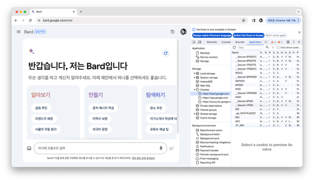
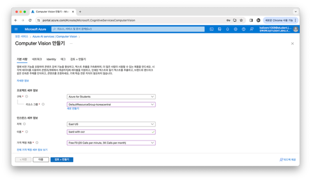
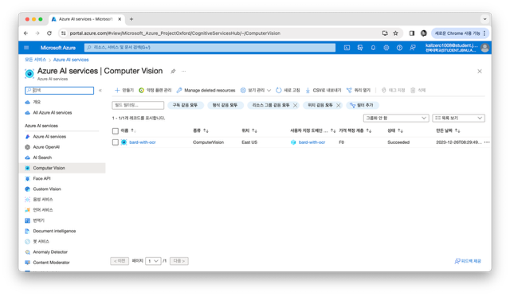
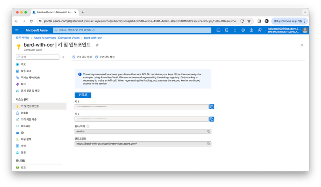

# 💬 Bard-with-OCR
Bard + Azure(computer vision) + Telegram
&rarr; Bard chat that possible conversations with text-based image.

## Result


## Setting
### Bard
https://bard.google.com
1. F12 - Application - Storage - Cookies - https://bard.google.com
2. copy ```__Secure_1PSID``` & ```__Secure_1PSIDCC``` & ```__Secure_1PSIDTS``` value
3. ```line 11~14, app.py```



### MS Azure ComputerVision
https://portal.azure.com/#view/Microsoft_Azure_ProjectOxford/CognitiveServicesHub/~/ComputerVision
1. make Computer Vision service
2. copy key and endpoint
3. ```line 13&14, app.py```

||
---| ---| 
||

### TelegramBot 
1. @BotFather
2. typing ```/newbot``` and set bot name
3. copy HTTP API token
4. ```line 76, app.py```

### Package
```pip install -r requirements.txt```
